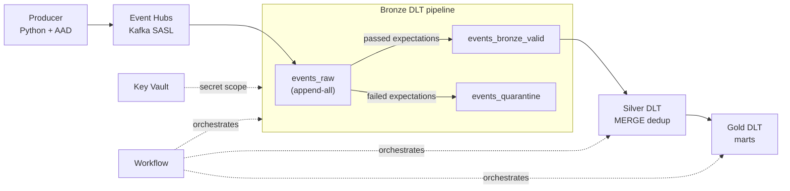

# Airline Streaming Data Platform

> **Streaming data platform on Azure Event Hubs + Databricks DLT — Unity Catalog governance, AAD-first auth, MERGE-based idempotent Silver, induced-failure postmortem, Terraform IaC. Built to interview standard, not tutorial standard.**

A production-aligned portfolio project. Real Azure infrastructure (now decommissioned to control cost), real DLT-built tables preserved in Unity Catalog, and real incidents documented as postmortems.

---

## At a glance

- **Bronze:** 1,862 events ingested → 1,858 valid + 4 quarantined
- **Silver:** 1,244 deduplicated rows (MERGE on a 7-column business key)
- **Gold:** 1 fact + 3 dimensions (star schema)
- **Workflow:** 3-stage Bronze → Silver → Gold orchestration with dependency enforcement
- **1 induced incident** with full written postmortem
- **10 SQL queries** on the Gold marts
- **Terraform IaC** — validated 10-resource plan

---

## Architecture



**Auth model:** AAD-first where the SDK supports it (producer → Event Hub via Azure CLI / Managed Identity). Key Vault + secret scope for the DLT consumer where Kafka SASL needs a connection string. RBAC scoped at the individual Event Hub and Key Vault level — no namespace-wide permissions.

---

## Three things this project proves

### 1. Idempotent deduplication holds under real-world failure

> I accidentally double-sent a 614-row CSV file mid-development. Bronze (append-only) accumulated **1,858 rows**. Silver MERGE reduced it to **1,244 — exactly the expected count**. That accident became the strongest piece of evidence in the whole project: the dedup logic survives operator error.

**Screenshot:** [`phase4_silver_dedup_proof.png`](docs/evidence/phase4_silver_dedup_proof.png)

### 2. Quarantine routing works because I broke it on purpose

> "Show me the quarantine table" with zero rows in it proves nothing. So I wrote `send_bad_events.py` — 4 deliberately malformed records with traceable IDs (`BAD_001` through `BAD_004`). All four routed to `events_quarantine` with reason codes; the valid path stayed clean at 1,858 rows. The DLT expectations metrics matched the row counts exactly.

**Screenshot:** [`phase3_quarantine_proof.png`](docs/evidence/phase3_quarantine_proof.png)

### 3. I induced a real failure and wrote it up

> I deliberately corrupted the Event Hub connection string stored in Key Vault. The DLT pipeline fetched the bad secret, failed to authenticate with the Kafka endpoint, and hung in retry until I cancelled it (2h 6m, UserCanceled). I diagnosed by tracing back from the Kafka auth error to the secret value, restored the correct string, re-ran (1m 56s), and wrote the incident up — including how I'd detect this in production before a human notices.

**Full postmortem:** [`docs/postmortem.md`](docs/postmortem.md)

---

## What this project is NOT

Honest scope boundaries. A senior engineer asks "what's missing"; I'd rather state it up front than have it surface as a gotcha:

- **Not multi-region.** Single `uksouth` region. Zero-downtime regional failover would require Geo-DR Event Hub pairing + Delta Sharing across workspaces — out of scope.
- **Not real-time analytics.** End-to-end latency is minutes, not sub-second. Gold reads Silver as batch by design (consistency over freshness).
- **Not production-scale.** ~1,800 events total. Performance numbers (e.g. OPTIMIZE/ZORDER results) are structural proof, not throughput claims.
- **Not schema-registry-backed.** Producer and consumer agree on a column set by convention, not by Avro/Protobuf contracts. Schema drift handling is documented in [`docs/schema_drift_runbook.md`](docs/schema_drift_runbook.md), but enforcement at the wire format would need a registry.
- **Not CDC.** Source is CSV files replayed through a producer, not a CDC stream from an OLTP system. The streaming pattern is the same; the source semantics are not.

---

## Why this isn't a tutorial clone

| Area | Typical tutorial | This project |
|------|------------------|--------------|
| Auth | Hardcoded SAS keys | AAD producer + Key Vault consumer with scoped RBAC |
| Governance | `hive_metastore` | Unity Catalog with 5 schemas |
| Bronze | `cloud_files` from CSV | Event Hubs streaming via Kafka, EH metadata preserved |
| Silver | Column renames | MERGE-based idempotent upserts on a 7-column business key |
| Quarantine | Dropped rows disappear | Explicit quarantine table with reason + timestamp + lineage |
| Gold | Single table | Star schema (1 fact + 3 dimensions) |
| Backfill | Not addressed | Replay pattern demonstrated in a parameterized notebook stub |
| Late data | Not addressed | Late-arriving records integrated through idempotent MERGE replay |
| Orchestration | Single pipeline | 3 separate pipelines with dependency chain (independent blast radius) |
| Failure modes | "It works on my cluster" | Induced incident + written postmortem |
| IaC | None | Terraform with validated plan, design notes for prod overrides |
| SQL | None | 10 interview-grade queries against the Gold marts |

---

## Repository

```text
/infra/terraform/        Plan-only Terraform — see docs/terraform_design_notes.md
/producer/               Python producer (AAD auth) + bad-data injector
/dlt/                    Bronze, Silver, Gold DLT notebooks
/jobs/                   Backfill notebook stub (replay pattern, not production-ready)
/sql/                    10 interview-grade queries on the Gold marts
/docs/                   Design notes, runbooks, contracts, evidence
└── evidence/            Screenshots from each phase
```

### Documentation

- [`runbook.md`](docs/runbook.md) — operating the platform: health checks, reruns, secret rotation
- [`data_contracts.md`](docs/data_contracts.md) — Bronze/Silver/Gold contracts, expectations, quarantine reason codes, SLAs
- [`postmortem.md`](docs/postmortem.md) — induced Key Vault secret-corruption incident, full write-up
- [`schema_drift_runbook.md`](docs/schema_drift_runbook.md) — additive vs breaking drift, detection, recovery
- [`terraform_design_notes.md`](docs/terraform_design_notes.md) — IaC reasoning + dev/prod tradeoffs
- [`cost_model.md`](docs/cost_model.md) — cost drivers, dev estimate, prod scaling logic

---

## How I'd describe this in an interview

> I built a streaming data platform that ingests airline flight data through Azure Event Hubs into Databricks Delta Live Tables, with a medallion architecture under Unity Catalog governance. The producer authenticates via Azure AD with no secrets in code. The consumer reads through a Key Vault-backed secret scope with RBAC scoped to the individual Event Hub. Bronze is append-only with Event Hub metadata preserved. Silver uses MERGE-based idempotent upserts — I can prove this because I accidentally double-sent a file and the Silver count stayed correct. Gold serves dimensional marts with freshness controlled through cross-pipeline orchestration. I have a documented late-data policy, a backfill notebook demonstrating the replay pattern, a quarantine pipeline for failed records, and a documented postmortem from a real incident I induced and resolved.

---

## Tech stack

Azure Event Hubs (Kafka endpoint) · Azure Key Vault · Azure Databricks · Delta Live Tables · Unity Catalog · Delta Lake · Python · PySpark · SQL · Terraform · Azure CLI / AAD

---

*Built by Faisal Ahmed.*